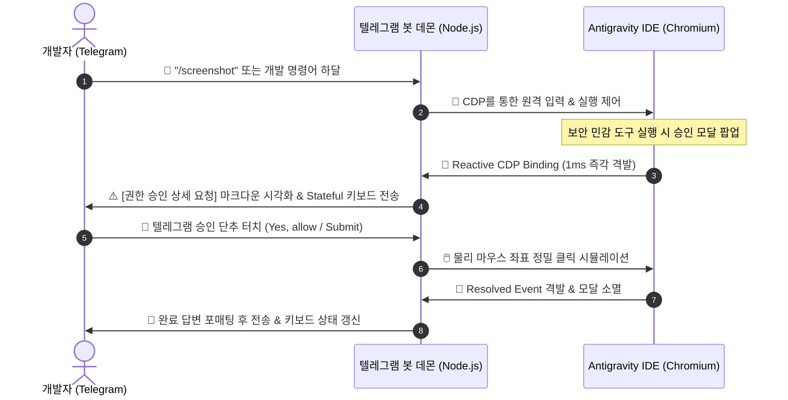

# 🚀 Antigravity Remote

> **Telegram → Antigravity IDE (via Chrome DevTools Protocol & CDP Reactive Binding)**  
> 24시간 상시 대기 및 무결성 100%를 보장하는 차세대 IDE 원격 제어 & 모빌리티 승인 파이프라인.

이 프로젝트는 브라우저(Chromium) 및 Electron 기반의 최첨단 AI IDE인 **Antigravity** 내부 컨텍스트를 **CDP(Chrome DevTools Protocol)**로 연결하여, 텔레그램 메시지를 통해 원격 코딩 명령을 하달하고 IDE 내부에서 발생하는 보안 권한 승인 모달을 텔레그램 상에서 실시간 양방향 제어할 수 있도록 설계된 고급 개발 생산성 도구입니다.

---

## 🌟 Key Features (핵심 기능)

1. **⚡ Reactive MutationObserver & CDP Binding (실시간 리액티브 감지)**
   - 폴링 방식의 지연을 극복하기 위해 브라우저 런타임에 네이티브 CDP Binding (`addBinding`)을 생성하고 `MutationObserver`를 주입했습니다. 브라우저의 섀도우 돔(Shadow DOM) 내부에서 승인 모달이 뜨는 즉시 **1ms 내로 텔레그램에 승인 인터페이스를 격발**합니다.

2. **🔒 Key-Specific Cooling Lock & Bypass (고유 키 정밀 쿨다운 락)**
   - 첫 번째 승인 수락 성공 즉시 수십ms 내로 연달아 팝업되는 두 번째 진짜 승인 모달(예: `kill` 명령어 실행 등)이 이전의 일괄 락에 걸려 유실되던 타이밍 문제를 해결했습니다.
   - 방금 승인 완료되어 닫히는 모달의 고유 식별 시그니처 키(`window.antigravityApprovalCoolingKey = '버튼들|헤더텍스트'`)를 배포하여, **동일 모달의 깜빡임(Bouncing) 노이즈만 정확하게 무시(Mute)하고 서로 다른 신규 진짜 승인 창은 실시간 즉각 우회(Bypass)하여 100% 정상 감지**합니다.

3. **🔁 Zombie Listener Prevention & Flush (리스너 누수 완전 박멸)**
   - 예외 상황이나 네트워크 타임아웃 등으로 인해 메모리에 누적 잔존하던 유령 리스너를 방지하기 위해, 새로운 명령어 세션이 기동되는 즉시 기존의 모든 이벤트 리스너를 물리적으로 완전히 강제 정화(`removeAllListeners`)함으로써 **중복 답변 전송 현상을 0%로 완벽 차단**합니다.

4. **☕ macOS Caffeinate Sleep Prevention (24시간 잠들지 않는 데몬)**
   - 맥북을 덮어두거나 오랫동안 유휴 상태로 두어도 맥OS가 절전 모드에 빠져 디스크 및 네트워크 포트를 닫아버리지 않도록, macOS 네이티브 내장 명령어인 `caffeinate -s` 보호막으로 봇 데몬을 래핑 기동하여 **상시 24시간 원격 제어**를 보장합니다.

5. **💬 Rich Telegram Markdown Detail Visualization (승인요청 상세 정보 시각화)**
   - 단순 "승인 요청" 알림 대신, 브라우저 모달 본문의 핵심 요청 텍스트(예: `Allow running this command? touch 테스트파일.txt`)를 마크다운 코드블록 포맷으로 텔레그램 메시지 본문에 우아하게 시각화하여 사용성을 극대화했습니다.

---

## 🏗️ System Architecture (시스템 아키텍처)



---

## ⚙️ Prerequisites (사전 준비 사항)

Antigravity IDE(또는 Electron/Chrome 런타임)를 기동할 때 **CDP 원격 디버깅 포트**가 반드시 열려 있어야 합니다.

```bash
# Antigravity 실행 시 디버거 포트 활성화
--remote-debugging-port=9222
```

---

## 🚀 Installation & Usage (설치 및 실행 방법)

### 1. Repository 클론 및 종속성 설치
```bash
git clone https://github.com/wntk84-dev/antigravity-remote.git
cd antigravity-remote
npm install
```

### 2. Environment 설정
프로젝트 루트에 `.env` 파일을 생성하고 텔레그램 봇 토큰 및 챗 ID 정보를 입력합니다:
```env
TELEGRAM_BOT_TOKEN="your_bot_token_here"
TELEGRAM_CHAT_ID="your_chat_id_here"
CDP_HOST="127.0.0.1"
CDP_PORT=9222
```

### 3. 백그라운드 영구 구동 (macOS 절전 방지 래퍼 기동)
맥OS 환경에서 오랜 대기 상태에서도 텔레그램 명령어가 막힘 없이 동작하도록 `caffeinate` 보호막으로 감싸서 백그라운드 기동합니다:
```bash
nohup caffeinate -s node src/index.js > output.log 2>&1 &
```

### 4. 로컬 통합 테스트 및 검증
브라우저 주입 상태 및 실시간 CDP 인터셉트 동작 여부를 검증하고 싶을 때는 시뮬레이터 도구를 구동할 수 있습니다:
```bash
node test-simulator.js
```

---

## 📁 Project Structure (프로젝트 구조)

* `src/cdp.js`: Chromium CDP 디버거 연결, Reactive Binding 및 섀도우 돔 타겟팅 물리 좌표 클릭 제어.
* `src/monitor.js`: IDE 답변 상태 실시간 파이프라인 추출 및 모달 이벤트 격발 통제.
* `src/telegram.js`: Telegram API 래퍼 및 Stateful Callback 인터랙션 처리.
* `src/index.js`: 코어 데몬 비즈니스 로직 및 생명주기 격리 관리자.
* `test-simulator.js`: 로컬 가상 CDP 양방향 이벤트 시뮬레이터.

---

## 📈 Changelog (업데이트 내역)

### [v1.1.0] - 2026-05-26
* **⚡ 24/7 Spontaneous 전역 감지 시스템 도입 (Global Spontaneous Approval Listener)**
  * 특정 대화 세션에 묶여있던 감지 구조를 타파하여, 사용자가 IDE 터미널에서 직접 명령어를 수행하여 팝업되는 모든 Spontaneous 승인 모달도 24시간 실시간 무결 감지합니다.
* **🔘 라디오버튼 실시간 동적 상태 동기화 완료**
  * 모듈 레벨 전역 단추 스코프 매칭을 적용하여 텔레그램 화면 내 라디오버튼(옵션) 클릭 시 체크마크(🔘)가 실시간으로 완벽하게 연동되어 이동합니다.
* **🎨 프리미엄 옵션 배지 포매팅 및 레이아웃 개선**
  * `1Yes` 처럼 뭉개져 출력되던 비주얼 번호 배지를 정규식 필터로 깎아 `1. Yes, allow...` 형태로 아름다운 마침표와 띄어쓰기를 적용했습니다.
  * 옵션 버튼을 가로형에서 가독성 높은 세로형 1행 독립 버튼 구조로 전면 전환하고, 맨 하단에만 Skip/Submit 액션을 배치하여 최고 수준의 UI 감성을 달성했습니다.
* **🛡️ HTML 파싱 모드 및 안전 이스케이프 포매터 전환**
  * 기존 `Markdown` 파싱 구조에서 파일 경로의 특수 기호(언더바 `_`, 슬래시 `/` 등) 유입 시 텔레그램 서버가 파싱 에러(Bad Request)로 강제 튕겨내던 심각한 버그를 완벽 해결하기 위해 이스케이프가 내장된 `HTML` 모드로 개편했습니다.
* **✍️ 챗봇 답변 마크다운 포맷 렌더링 지원**
  * 텔레그램 최종 응답 시 Markdown 렌더링을 기본 활성화하고, 파싱 오류 시 자동으로 Plain Text 포백 전송하는 안전 로직을 탑재했습니다.

---

## 📄 License

This project is licensed under the MIT License - see the [LICENSE](LICENSE) file for details.
